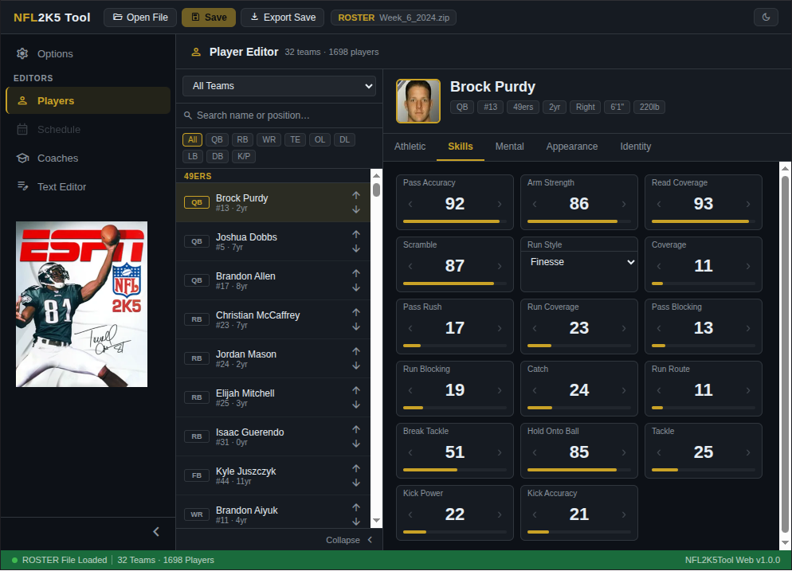

# NFL2K5Tool Web

A browser-based editor for NFL 2K5 gamesave files. Load a save, edit players, schedules, and coaches, then export back to your console format — no installation required.

Try it now: https://BAD-AL.github.io/nfl2k5tool_web/

---

## Features

- **Player Editor** — Edit attributes, appearance, identity, and stats for every player on every team. Includes a face photo picker with the full player photo library built in.
- **Schedule Editor** — View and edit the franchise schedule via a weekly grid, team matrix, and integrity checker.
- **Text Editor** — Direct access to the underlying text representation of the save data, with search, line numbers, and wrap toggle.
- **Options** — Control which sections are included in the text output (players, schedule, appearance, attributes, free agents, draft class, coaches).
- **Export** — Export back to your original format or convert between Xbox and PS2 formats.

---

## Supported File Formats

| Extension | Format |
|---|---|
| `.zip` | Xbox save (zip archive) |
| `.bin` / `.img` | Xbox Memory Unit |
| `.max` / `.psu` | PS2 save |
| `.ps2` | PS2 Memory Card |
| `.dat` | Raw DAT |

### Format conversion rules

- **Xbox saves** (`.zip`, `.bin`, `.img`) can be exported to any format
- **PS2 saves** (`.ps2`, `.max`, `.psu`) can be exported to PS2 formats and raw DAT
- **Raw DAT** (`.dat`) can only be exported as raw DAT
- Memory card exports (`.bin`, `.img`, `.ps2`) are written to a fresh card

---

## Usage

1. Open the app in your browser
2. Click **Open** and select your gamesave file
3. Use the nav rail on the left to switch between editors
4. Edit players, schedule, or raw text as needed
5. Click **Export** to download the modified save

---

## Dependencies

- [nfl2k5tool_dart](https://github.com/BAD-AL/nfl2k5tool_dart) — binary decode/encode engine
- [archive](https://pub.dev/packages/archive) — ZIP handling for the photo library
- [web](https://pub.dev/packages/web) — Dart browser bindings

---

## Notes

- No data is sent to any server — everything runs locally in the browser.
- The 'Dart' programming language was chosen because of it's modern Object-Oriented design and it's versatility. Dart can be used as a scripting language, compiled to an executable file [Windows, Linux, Mac, iOS, Android], or run in a web browser (compiled to WASM or JavaScript).
- Claude Code was used in the creation of this app, check 'Spec' folder for initial prompts.
- For local / offline use check out the `docs/` folder

## Related projects
- https://github.com/BAD-AL/NFL2K5Tool
- https://github.com/BAD-AL/dart_mymc 
- https://github.com/BAD-AL/xbox_memory_unit_tool
- https://github.com/BAD-AL/nfl2k5tool_dart

